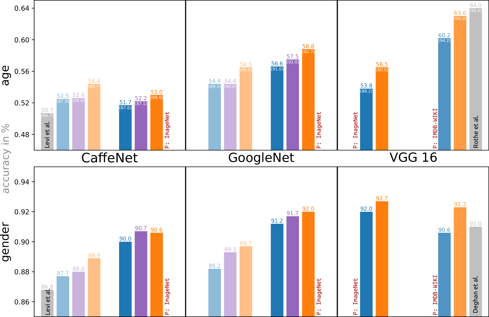
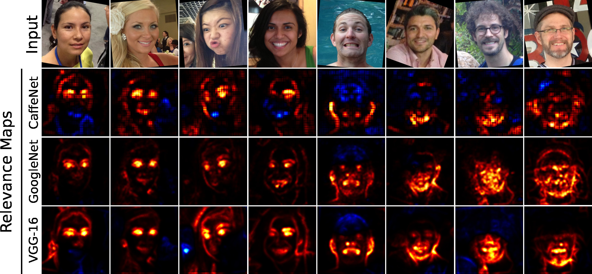

# Understanding and Comparing Deep Neural Networks for Age and Gender Classification - Data and Models
This repository contains all the evaluated models for which results are reported in the paper titled paper titled ["Understanding and Comparing Deep Neural Networks for Age and Gender Classification"](http://openaccess.thecvf.com/content_ICCV_2017_workshops/papers/w23/Lapuschkin_Understanding_and_Comparing_ICCV_2017_paper.pdf) as published in the proceedings of the IEEE Workshop on Analysis and Modeling of Faces and Gestures (AMFG) at the International Conference on Computer Vision (ICCV) 2017. 


*Model performances, depending on architecture, initialization and data preprocessing, averaged over all folds of the data set. For additional results, see section [Result Overview](https://github.com/sebastian-lapuschkin/understanding-age-gender-deep-learning-models/blob/master/README.md#result-overview).*

That is, this repo contains the `deploy.prototxt` and `train_val.prototxt` files for all model architectures, pretraining and preprocessing choices for which performance measures are reported in the paper linked above.
`mean.binaryproto` files for the employed datasets and Caffe are supplied as well.
This repository shares scripts and workflows with [Gil Levi's age and gender deep learning project page](https://github.com/GilLevi/AgeGenderDeepLearning).

Due to github's hard file size limit of 100mb per file, all model weights (i.e. the `*.caffemodel` files) and `lmdb` data files are hosted externally, via a nextcloud service of the Fraunhofer Heinrich Hertz Institute (see section [Repository Content](https://github.com/sebastian-lapuschkin/understanding-age-gender-deep-learning-models/blob/master/README.md#content) below).

Should you find any code or the models from this github repository useful, please add a reference to the corresponding publication to your work:
```
@incproceedings{lapuschkin2017understanding,
  author = {Lapuschkin, Sebastian and Binder, Alexander and M\"uller, Klaus-Robert and Samek, Wojciech},
  title = {Understanding and Comparing Deep Neural Networks for Age and Gender Classification},
  booktitle = {Proceedings of the IEEE International Conference on Computer Vision Workshops (ICCVW)},
  pages = {1629-1638},
  year = {2017},
  doi = {10.1109/ICCVW.2017.191},
  url = {https://doi.org/10.1109/ICCVW.2017.191}
}
```

All heatmap visualizations shown in the paper, such as the image at the top of the page, have been generated using the LRP implementation for Caffe, as provided by in the [LRP Toolbox](https://github.com/sebastian-lapuschkin/lrp_toolbox).
Scripts assisting in the computation of heatmap visualizations can be found in folder *`TODO ADD ME`*


*Exemplary LRP heatmap visualizations for the predicted classes on a gender prediction task*


## Repository Content
- Folder `folds` contains the dataset split description for the [Adience benchmark data](https://talhassner.github.io/home/projects/Adience/Adience-data.html#agegender) used for training and evaluation. This folder is an extension to the one found in [Gil Levi's repo](https://github.com/GilLevi/AgeGenderDeepLearning) and contains additional preprocessing settings.
- `training_scripts` contains shell scripts used for starting the training of the neural network models.
- `DataPrepartionCode` contains scripts for generating `mean.binaryproto` and `lmdb` binary blobs from raw Adience image data. This folder is an extension to the one found in [Gil Levi's repo](https://github.com/GilLevi/AgeGenderDeepLearning) and contains additional preprocessing settings.
- The folder `mean_images` contains the `mean.binaryproto` files for all folds and preprocessing choices, as used for training, validation and testing
- The folder `model_definitions` contains the `*.prototxt` files for Caffe, i.e. a description of the model architecture each. Here, a naming pattern `[target]_[init]_[arch][_preproc]` applies, where
  + `target` is from `{age, gender}` and describes the prediction problem
  + `init` is from `{fromscratch, finetuning, imdbwiki}` and describes random initialization, a weight intialization from ImageNet pretraining, and a weight initialization from ImageNet pretraining followed by [IMDB-WIKI](https://data.vision.ee.ethz.ch/cvl/rrothe/imdb-wiki/) pretraining, respectively.
  + `arch` is from `{caffereference, googlenet, vgg16, net_definitions}` and describes the architecture of the model. Here, `net_definitions` refers to the model architecture used in [Gil Levi's repo](https://github.com/GilLevi/AgeGenderDeepLearning).
  + The `_preproc` suffix is optional and refers to `_unaligned` images (i.e. training images only under rotation alignment), aligned training images (landmark-based alignment, so suffix) or `_mixed` alignment, (i.e. both images under landmark-based and rotation-based alignment are used for trainng)
  + [ ] TODO add starting weights to datacloud
- [The `lmdb` files](https://datacloud.hhi.fraunhofer.de/nextcloud/s/n6BLLnGPzinbe55) used for model training, validation testing can be downloaded [here](https://datacloud.hhi.fraunhofer.de/nextcloud/s/n6BLLnGPzinbe55).
-  [The model weights](https://datacloud.hhi.fraunhofer.de/nextcloud/s/TQnGNJmQZLWkQ7X) (i.e. the `*.caffemodel` files) to the neural network descriptions contained in this repository can be downloaded [here](https://datacloud.hhi.fraunhofer.de/nextcloud/s/TQnGNJmQZLWkQ7X). These files match the model definitions in folder `model_definitions`
- `heatmap_drawing` contains scripts generating configuration files for computing LRP heatmaps using the [LRP Toolbox](https://github.com/sebastian-lapuschkin/lrp_toolbox) for Caffe.

**Note** that you will have to adapt the (absolute) paths denoted in scripts and model description files in order to use the code.

## Result Overview
Below table briefly presents the obtained results from the paper this repository belongs to.

|           |                       |                       |                     |                         |     |            |                |               |                   |               |
|:----------|----------------------:|----------------------:|--------------------:|------------------------:|:---:|:-----------|---------------:|--------------:|------------------:|--------------:|
| **age**   |      **AdienceNet**   |      **CaffeNet**     |      **GoogleNet**  |      **VGG16**          |     | **gender** |  **AdienceNet**|  **CaffeNet** |     **GoogleNet** |      **VGG16**|
| \[i, ⋅\]  |  51.4<sub>87.0</sub>  |  52.5<sub>87.9</sub>  |  54.4<sub>89.3</sub>|                         |     | \[i, ⋅\]   |            88.1|           87.7|               88.2|               |
| \[r, ⋅\]  |  51.9<sub>87.4</sub>  |  52.6<sub>89.0</sub>  |  54.4<sub>90.0</sub>|                         |     | \[r, ⋅\]   |            88.3|           88.0|               89.3|               |
| \[m, ⋅\]  |  53.6<sub>88.4</sub>  |  54.4<sub>89.7</sub>  |  56.5<sub>90.8</sub>|                         |     | \[m, ⋅\]   |            89.0|           88.9|               89.7|               |
| \[i,n\]   |                       |  51.7<sub>87.6</sub>  |  56.6<sub>91.0</sub>|  53.8<sub>88.2</sub>    |     | \[i,n\]    |                |           90.0|           **91.2**|       **92.0**|
| \[r,n\]   |                       |  52.2<sub>87.1</sub>  |  57.5<sub>92.0</sub>|                         |     | \[r,n\]    |                |           90.7|           **91.7**|               |
| \[m,n\]   |                       |  53.0<sub>88.4</sub>  |  58.8<sub>92.7</sub>|  56.5<sub>90.0</sub>    |     | \[m,n\]    |                |           90.6|           **92.0**|       **92.7**|
| \[i,w\]   |                       |                       |                     |  60.2<sub>94.2</sub>    |     | \[i,w\]    |                |               |                   |           90.6|
| \[r,w\]   |                       |                       |                     |                         |     | \[r,w\]    |                |               |                   |               |
| \[m,w\]   |                       |                       |                     |  63.0<sub>96.0</sub>    |     | \[m,w\]    |                |               |                   |       **92.3**|
|           |                       |                       |                     |                         |     |            |                |               |                   |               |

**Face categorization results in accuracy and percent, using
oversampling for prediction.** *Left:* Results for **age**
classification. Small numbers next to the accuracy score show 1-off
accuracy, the accuracy of predicting the correct age group *or* an
adjacent one. *Right:* Results for **gender** prediction.
Entries in the *gender* and *age* column indicate choices for data preprocessing and model initialization:
- *i*: in-plane, landmark based face alignment, *r*: rotation based alignment, *m*: combining *i* and *r* for training and using *r* for testing
- *n*: Imagenet pretraining, *⋅*: random weight initialization and *w*: IMDB-WIKI pretraining following ImageNet pretraining

**Bold** values match or exceed the at publication time reported state of the art results on
the Adience benchmark dataset.
